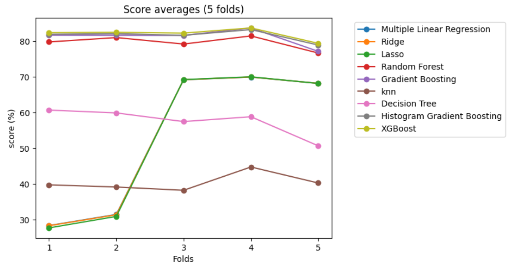
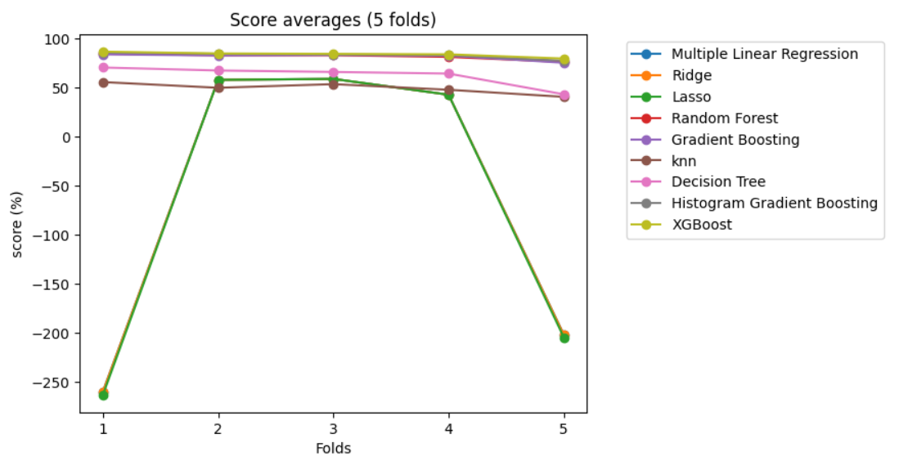
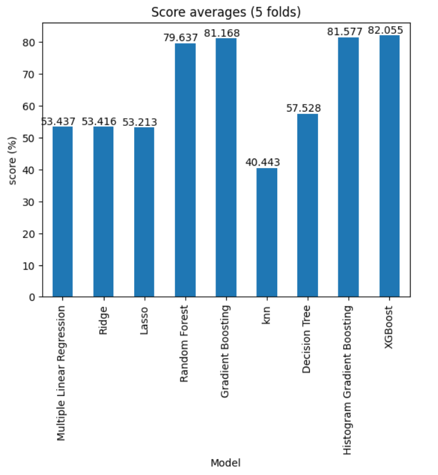
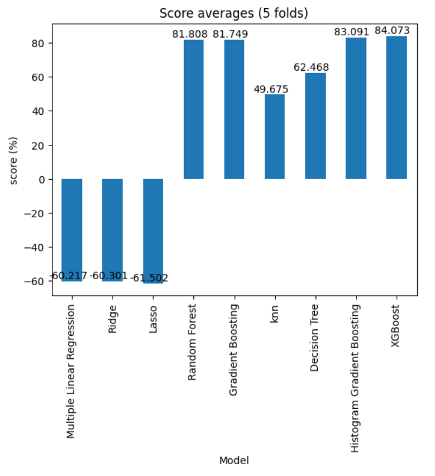

<h1 align="center"> IMMO Eliza ML </h1>

## Table of Contents
- [Table of Contents](#table-of-contents)
- [Mission](#mission)
- [Overview](#overview)
- [Dependencies](#dependencies)
- [Project structure](#project-structure)
- [Personal situation](#personal-situation)

## Mission

The real estate company Immo Eliza asked you to create a machine learning model to predict prices of real estate properties in Belgium.

After the scraping, cleaning and analyzing, you are ready to preprocess the data and finally build a performant machine learning model!

## Overview

This project aims to predict real estate prices using machine learning regression models. It involves data collection, preprocessing, model training, evaluation, and visualization of results.

During the process, the data was separated into Houses and Apartments and different Machine Learning models were used.

The models:

    . Multiple Linear Regression
    . Ridge Regression
    . Lasso Regression
    . Random Forest Regression
    . Gradient Boosting Regression
    . K-Nearest Neighbors Regression
    . Decision Tree Regression
    . Histogram Gradient Boosting Regression
    . XGBoost Regression

The k-fold cross validation technique was applied with 5 folds to assess the accuracy of the models.

The following shows the accuracy for each model by property type:

  
  

    <h3 align="center">House</h3>
    
  

  

<h3 align="center">Apartments</h3>
    
  

  

    <h3 align="center">House</h3>
    
  

  

<h3 align="center">Apartments</h3>
    
  

## Dependencies
    numpy==1.26.4
    pandas==2.2.1
    matplotlib==3.8.2
    scikit-learn==1.4.1.post1
    xgboost==2.0.3

## Project structure

- [data/](data):&#9;Contains the data used in the project, divided into the following subdirectories:
    - [interim/](data/interim):&#9;Temporarily processed raw data.
    - [processed/](data/processed):&#9;Processed and clean data used for analysis and modeling.
    - [raw/](data/raw):&#9;Raw, unprocessed data.

- [models/](models):&#9;Folder to store trained models.

- [notebooks/](notebooks):&#9;Jupyter notebooks used for exploratory data analysis, modeling, and visualization.

- [src/](src):&#9;Contains the source code of the project, organized into the following subdirectories:
    - [data/](src/data):&#9;Scripts related to data manipulation and preparation.
    - [img/](src/img):&#9;Images used in project documentation.
    - [models/](src/models):&#9;Implementations of machine learning models.
    - [scripts/](src/scripts):&#9;Utility scripts or auxiliary functions.

- [README.md](README.md):&#9;This file you are reading, providing information about the project structure and how to navigate it.

- [MODELSCARD.md](MODELSCARD.md):&#9;Detailed documentation about implemented models, their description, and performance.

- [requirements.txt](requirements.txt):&#9;List of project dependencies to facilitate package installation.

## Personal situation
While doing this project I was part of the ARAI6 group of the <a href="https://becode.org/all-trainings/pedagogical-framework-ai-data-science/">AI Bootcamp</a> training organized by <a href="https://becode.org/">BeCode</a> in Ghent. 

______________________________________
   <a href="https://www.linkedin.com/in/karel-rodriguez-duran/">Karel Rodríguez Durán</a>
